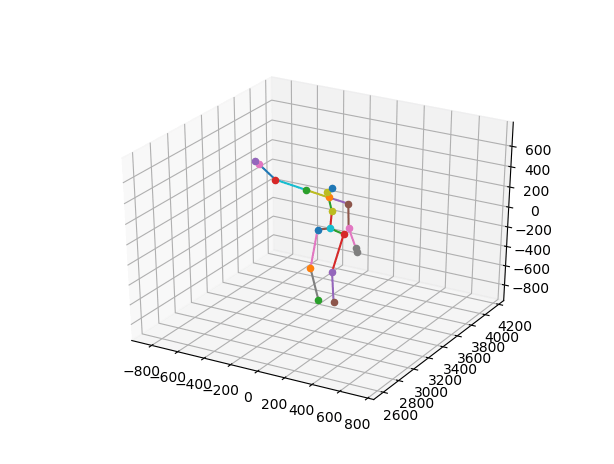
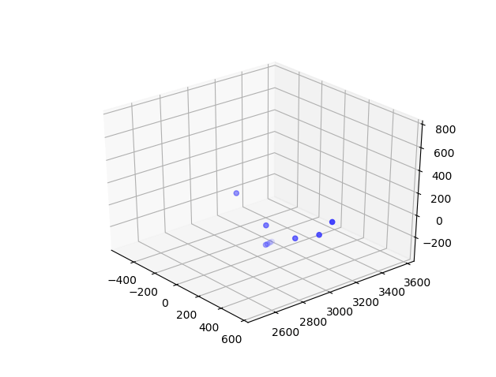
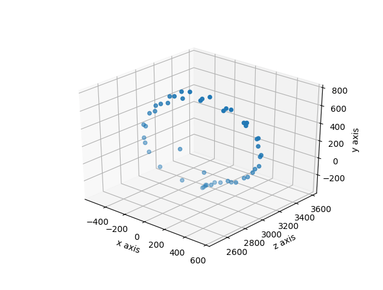

# 3D Joint Data Visualization
Python program to visualize joint data gathered from Orbecc sensor and Astra SDK

### Dependencies
- Matplotlib required:  `pip install matplotlib`
- Developed on python 3.6.2

### How to Use
- Each of the three visualizations are run indepentently just by running the python program, for example `python body_plotter_animated.py`
- Example .csv files are provided in /data
- Global variables can be changed at the top of any one file
    - NUM_FRAMES denotes the **maximum** number of frames to be rendered. If longer than the number of frames in the file, it will be ignored
    - SOURCE_FILE denotes the full path to the .csv file you would like to visualize, for example `SOURCE_FILE = 'data/right-arm.csv'
    - FRAME_TIME denotes the amount of time in milliseconds to spend on each frame. Fast frame times may cause the program to lag behind.

## Examples
#### body_plotter_animated (one body)

#### body_plotter_animated (multiple bodies, no joint points)

#### joint_plotter_animated

#### joint_plotter
